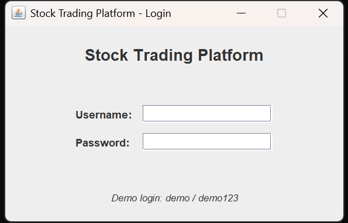
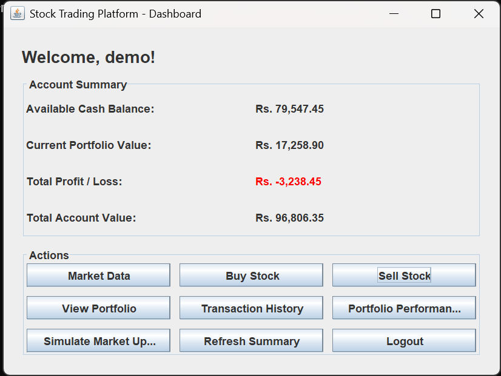
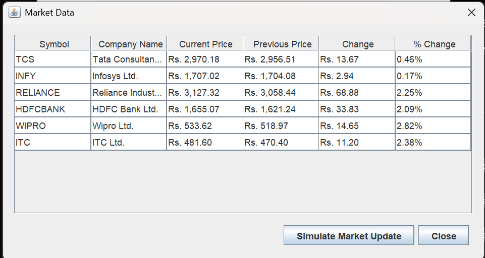
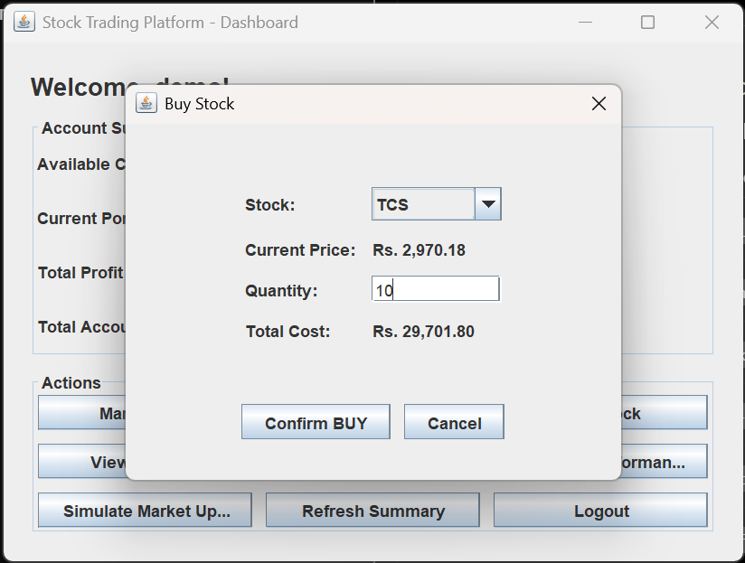
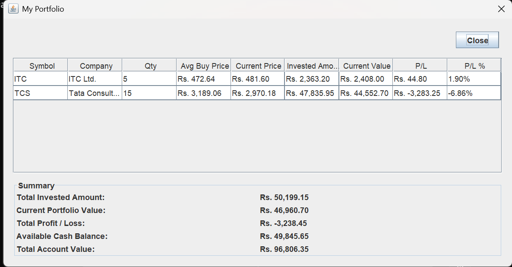
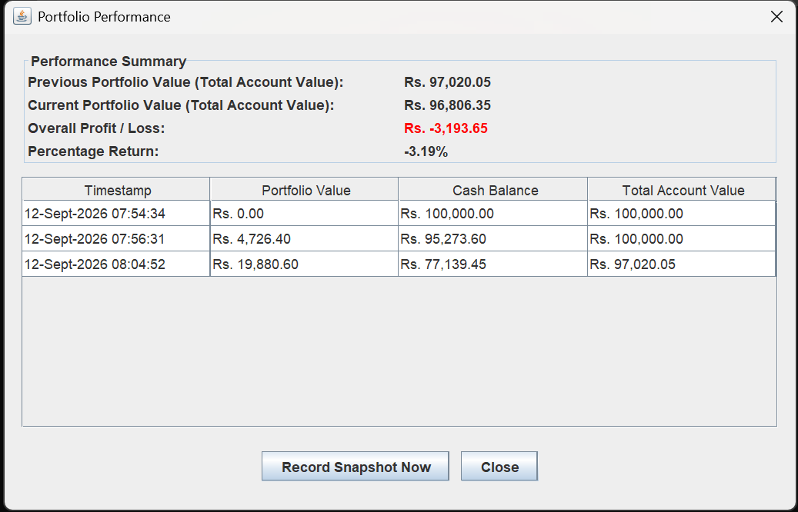
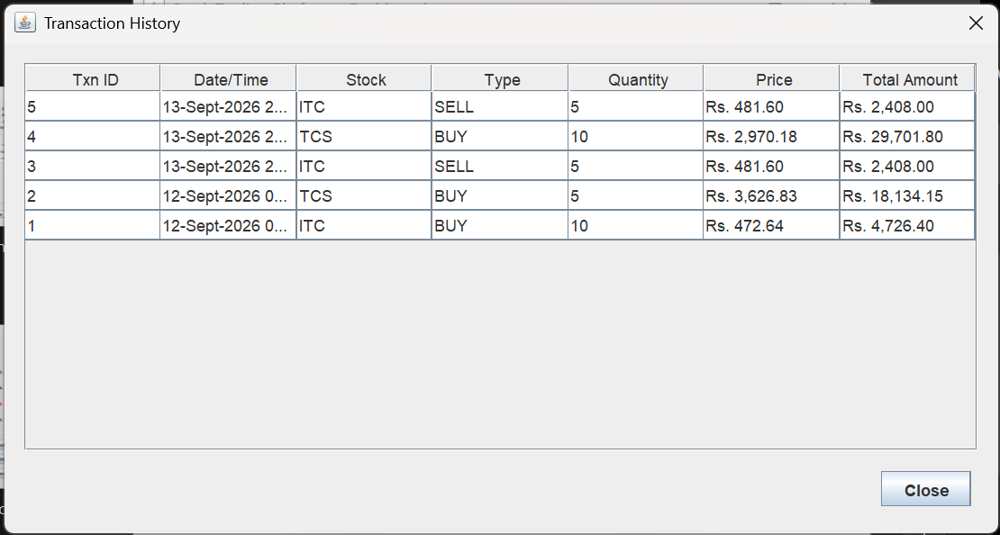
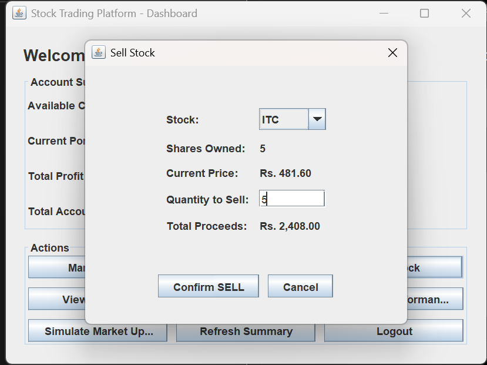

# Stock Trading Platform

A desktop **stock trading simulator** built with **Java 21, Maven, and Java Swing**. It lets a
user register/login, view simulated market data, buy and sell stocks, and track their portfolio's
performance over time — all backed by simple, transparent file-based persistence.

This project was built as a clean, interview-ready demonstration of core Object-Oriented
Programming concepts in Java, without relying on heavy frameworks.

---

## 1. Project Description

The platform simulates a basic stock exchange. A user starts with a cash balance, can browse a
small market of sample stocks whose prices fluctuate on demand, place BUY and SELL orders, and
monitor their holdings, transaction history, and overall profit/loss — including a return
percentage relative to their starting balance.

## 2. Objectives

- Demonstrate a complete, runnable Java desktop application using clean OOP design.
- Model a realistic (if simplified) trading domain: users, stocks, holdings, orders, transactions.
- Practice encapsulation, inheritance, polymorphism, abstraction, composition, and exception handling.
- Provide a project that is easy to explain, extend, and defend in a technical interview.

## 3. Features

- **User Management** — register, login, logout, view balance.
- **Market Data** — view symbol, company name, current price, previous price, change, and % change
  for 6 sample stocks; simulate market movement on demand.
- **Buy Stock** — pick a stock, enter quantity, see live total cost, with validation (positive
  quantity, sufficient balance, stock must exist).
- **Sell Stock** — pick an owned stock, enter quantity, see live proceeds, with validation
  (cannot sell more than you own).
- **Portfolio** — per-holding quantity, average buy price, current price, invested amount, current
  value, profit/loss and profit/loss %, plus account-wide totals.
- **Transaction History** — every BUY/SELL recorded with ID, timestamp, stock, quantity, price, and total.
- **Portfolio Performance** — snapshot-based tracking of total account value over time, with
  overall profit/loss and percentage return since account creation.

## 4. Technologies Used

| Technology            | Purpose                                   |
|------------------------|--------------------------------------------|
| Java 21                | Core language                              |
| Maven                  | Build & dependency management              |
| Java Swing             | Desktop GUI                                |
| File I/O (CSV)         | Persistence for users, stocks, holdings, transactions, performance |
| JUnit 5                | Unit testing (`HoldingTest`)               |

No external GUI or charting libraries are used — the "Portfolio Performance" screen uses a simple,
table-based history (a design choice explicitly allowed when a charting dependency would add
unnecessary complexity to a student project).

> **Why file-based persistence instead of PostgreSQL?** A reference PostgreSQL schema
> (`database.sql`) that mirrors the exact data model is included for anyone who wants to extend the
> project. By default, though, the app uses plain CSV files under `./data` so it can be imported
> and demonstrated immediately, with zero external setup.

## 5. OOP Concepts Used

- **Encapsulation** — all model fields (`User`, `Stock`, `Holding`, …) are private with controlled
  getters/setters and behaviour methods (`debit`, `credit`, `addShares`, `updatePrice`, etc.).
- **Abstraction** — `Transaction` is an abstract class exposing common behaviour (`getTotalAmount()`)
  while leaving `getType()` to subclasses.
- **Inheritance** — `BuyTransaction` and `SellTransaction` both extend `Transaction`.
- **Polymorphism** — code that works with `Transaction` (e.g. `TransactionHistoryDialog`) calls
  `getType()` and gets different behaviour depending on the concrete subclass.
- **Composition** — `PortfolioService` is composed of a `HoldingRepository`, `PerformanceRepository`
  and `MarketService`; `TradingService` is composed of four other services.
- **Interfaces / functional interfaces** — `Runnable` callbacks are used to refresh the dashboard
  after a successful trade, and `DocumentListener` is implemented for live UI updates.
- **Exception Handling** — six custom checked exceptions (`InsufficientBalanceException`,
  `InsufficientSharesException`, `StockNotFoundException`, `InvalidQuantityException`,
  `AuthenticationException`, `UserAlreadyExistsException`) are declared, thrown, and caught with
  user-facing messages instead of crashing the application.

## 6. Project Architecture

The project follows a classic **layered architecture**:

```
UI (Swing)  →  Service (business logic)  →  Repository (persistence)  →  Model (data)
```

See `PROJECT_STRUCTURE.md` for the full file tree and a walkthrough of the BUY data flow.

## 7. Database / File Structure

By default, data is persisted as CSV files created automatically on first run under `./data`:

- `data/users.csv` — id, username, password, balance, startingBalance, createdAt
- `data/stocks.csv` — symbol, companyName, currentPrice, previousPrice
- `data/holdings.csv` — userId, symbol, quantity, averageBuyPrice
- `data/transactions.csv` — id, userId, type, symbol, quantity, price, timestamp
- `data/portfolio_performance.csv` — userId, timestamp, portfolioValue, cashBalance, totalValue

An equivalent PostgreSQL schema is provided in `database.sql` for reference/extension.

## 8. Class Descriptions

| Class | Responsibility |
|---|---|
| `User` | A registered account: credentials, cash balance, starting balance. |
| `Stock` | A tradable instrument: symbol, name, current/previous price. |
| `Holding` | A user's position in one stock: quantity + weighted average buy price. |
| `Transaction` (abstract), `BuyTransaction`, `SellTransaction` | Immutable record of an executed trade. |
| `Order` | Lightweight intent-to-trade object used internally for validation. |
| `PortfolioSnapshot` | A point-in-time record of total portfolio value, for performance tracking. |
| `UserService` | Registration, login/logout, balance persistence. |
| `MarketService` | Owns the list of stocks and simulates price movement. |
| `PortfolioService` | Applies buys/sells to holdings, computes valuations, records snapshots. |
| `TransactionService` | Records and retrieves transaction history. |
| `TradingService` | Orchestrates a BUY/SELL end-to-end with full validation. |
| `*Repository` | File-based CRUD for each entity (CSV read/write). |
| `*Exception` | Domain-specific checked exceptions. |
| `ui.*` | Swing screens (see Section 12 "How to Run" for the screen list). |

## 9. How to Install

**Prerequisites:**
- JDK 21 or later
- Maven 3.8+
- Eclipse or IntelliJ IDEA (or any IDE with Maven support)

**Steps:**
1. Extract `Stock-Trading-Platform.zip`.
2. Open Eclipse/IntelliJ → **Import/Open Project** → select the extracted `Stock-Trading-Platform`
   folder → choose **"Import as Maven Project"**.
3. Let the IDE resolve dependencies (only JUnit 5, for tests).

## 10. How to Configure

No configuration is required. The application creates a `data/` folder next to wherever it is run
from, and seeds sample stocks and a demo user automatically on first launch. To reset all data,
simply delete the `data/` folder and restart the app.

## 11. How to Run

**From an IDE:** Run `com.stocktrading.Main` as a Java Application.

**From the command line (Maven):**
```bash
mvn compile exec:java -Dexec.mainClass="com.stocktrading.Main"
```
*(If you'd rather not add the exec plugin, simply run `Main.java` from your IDE — that's the
simplest path.)*

**As a packaged JAR:**
```bash
mvn package
java -jar target/stock-trading-platform.jar
```

## 12. Demo Username / Password

```
Username: demo
Password: demo123
Starting Balance: ₹100,000
```

## 13. Sample Workflow

1. Launch the app → **Login** with `demo` / `demo123`.
2. Click **Market Data** to view the 6 sample stocks (TCS, INFY, RELIANCE, HDFCBANK, WIPRO, ITC).
3. Click **Buy Stock** → select `TCS` → quantity `5` → **Confirm BUY**.
4. Click **View Portfolio** to see your new TCS holding, invested amount, and current value.
5. From the Dashboard, click **Simulate Market Update** to move prices.
6. Reopen **Portfolio** to see the current value / profit-loss change.
7. Click **Sell Stock** → select `TCS` → sell a few shares → **Confirm SELL**.
8. Click **Transaction History** to see both the BUY and SELL recorded.
9. Click **Portfolio Performance** → **Record Snapshot Now** to log the current total account
   value, then review overall profit/loss and % return since account creation.

## 14. Future Enhancements

- Swap file-based persistence for the provided PostgreSQL schema (`database.sql`) via JDBC DAOs.
- Add a real-time line chart (e.g. JFreeChart) for portfolio performance.
- Support limit/stop orders instead of only market-price BUY/SELL.
- Multi-user concurrent sessions instead of one logged-in user per app instance.
- Password hashing (currently stored in plain text for simplicity — **not** production-ready).

## 15. Screenshots

*(Placeholder — add screenshots of the Login, Dashboard, Market Data, Buy/Sell, Portfolio, and
Performance screens here after running the app.)*


screenshots/
 ### 1. Login Screen


### 2. Dashboard


### 3. Market Data


### 4. Buy Stock


### 5. Portfolio


### 6. Performance


### 7. Transactions


### 8. Sell Stock



---

## Important Note on Security

This is a learning/demo project. Passwords are stored in plain text in `data/users.csv` for
simplicity. **Do not** reuse a real password when registering, and do not use this persistence
approach in a production system.
